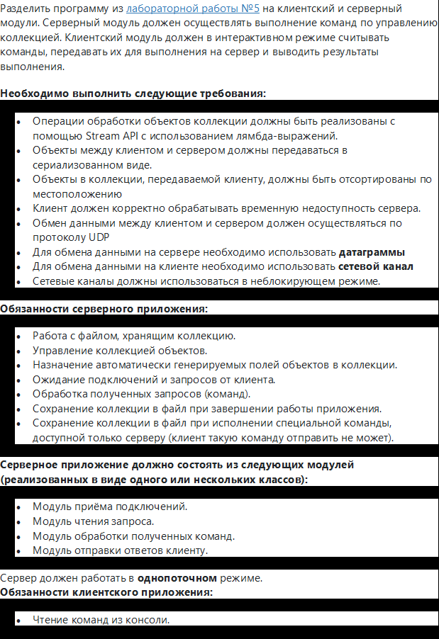
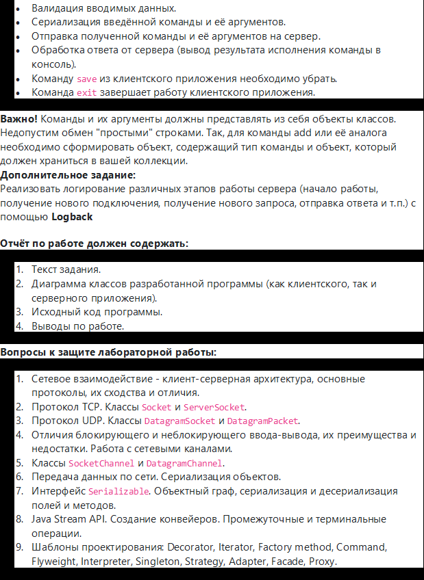

# Лабораторная работа 6, вариант 3117700

[Отчет](task/lab6.docx)  
[Перейти к Java коду клиента](Client/src/main/java)  
[Перейти к Java коду сервера](Server/src/main/java)  
В папке __external__ находятся дополнительные файлы к проекту, такие как
скрипты, необходимые для сдачи лабораторной работы.

### Билд проекта с помощью mvn
'mvn clean install; mvn --projects Server,Client clean compile assembly:single;'  
jar файлы будут находится в папке 'target'.

### Задание

