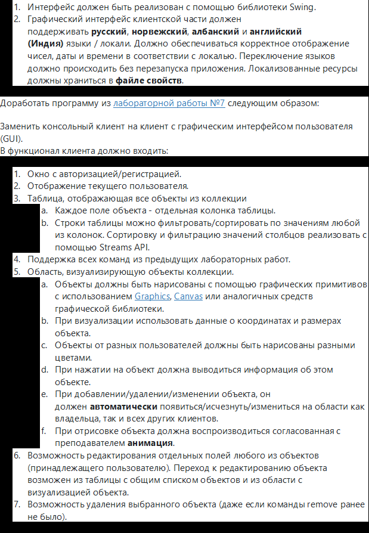
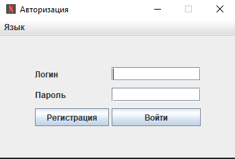
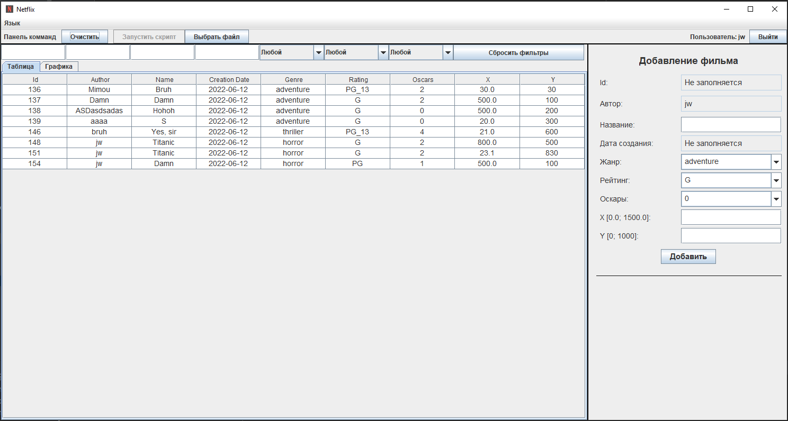
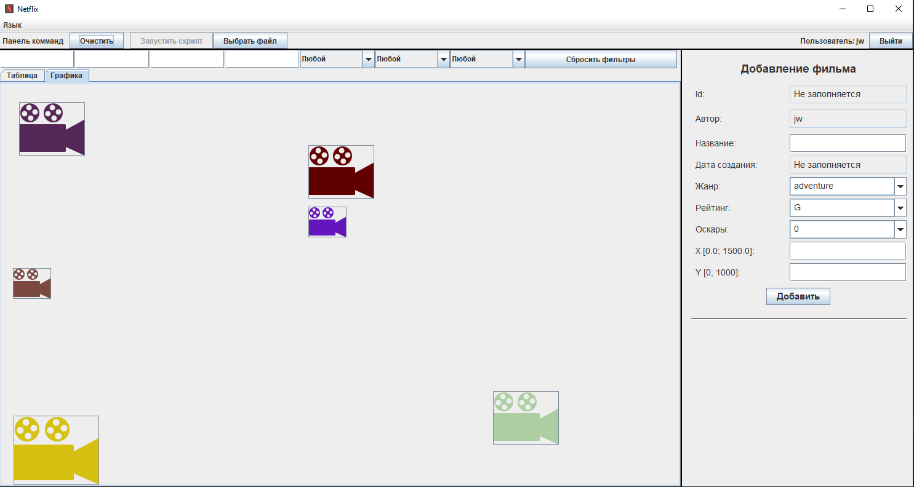

# Лабораторная работа 8, вариант 3117901

[Отчет](_task/lab8.docx)  
[Перейти к Java коду клиента](Client/src/main/java)  
[Перейти к Java коду сервера](Server/src/main/java)  
В папке __external__ находятся дополнительные файлы к проекту, такие как
скрипты, необходимые для сдачи лабораторной работы.  
В папке __sql_scripts__ находятся скрипты для создания sql таблиц.

### Билд проекта с помощью mvn
'mvn clean install; mvn --projects Server,Client clean compile assembly:single;'  
jar файлы будут находится в папке 'target'.

### Задание

### Интерфейс

